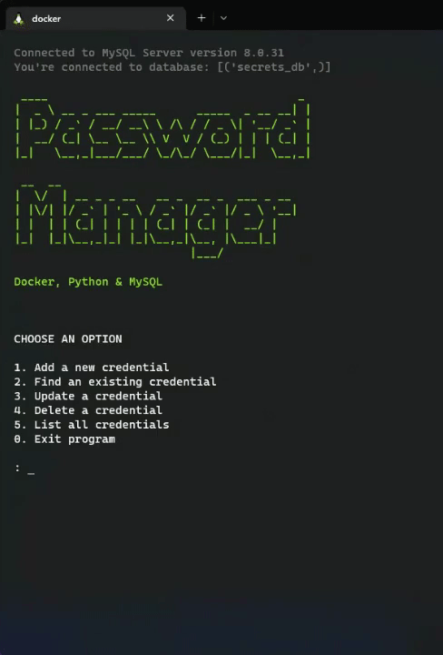
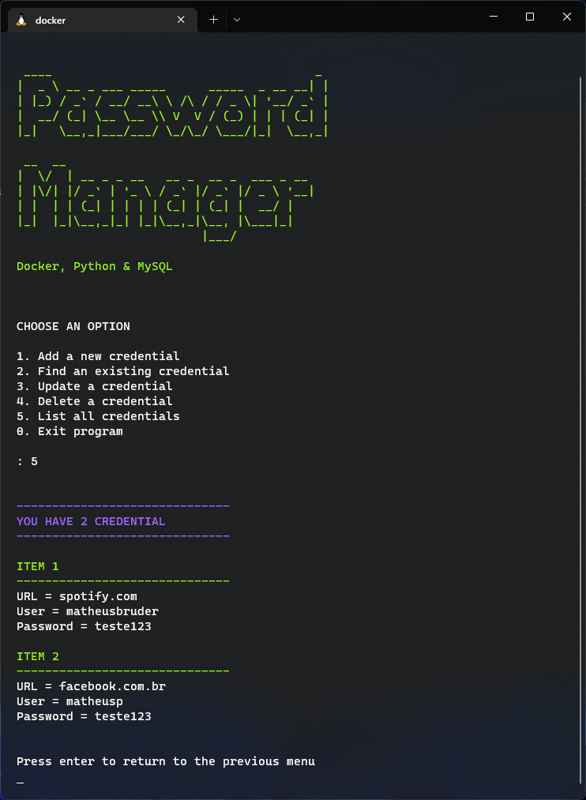

# Password Manager v1.0

Este é um trabalho da disciplina SI202A da Faculdade de Tecnologia da Unicamp, cujo objetivo foi desenvolver um app em sua linguagem favorita para conseguir aprender uma tecnologia nova, que no caso foi o `Docker` & `Docker-compose`.

Para exemplicar a utilização do `docker` foi criado um gerenciador de senhas utilizando python via linha de comando.


## Instalação

Faça o clone do repositório e acesse a pasta

```bash
  git clone https://github.com/mpbruder/password_manager.git
  cd password_manager
```

Inicialize o `docker-compose` em background

```bash
  docker-compose up -d
```

Rode a aplicação python

```bash
  docker exec -it python-container python3 main.py
```


## Demonstração

Inserção de uma nova credencial no banco de dados. Para acessar outras imagens do aplicativo, [clique aqui](img/).




## Melhorias

  Aqui estão algumas possíveis melhorias para o projeto:
  * Gerenciamento de usuários
  * Criptografia das senhas 

